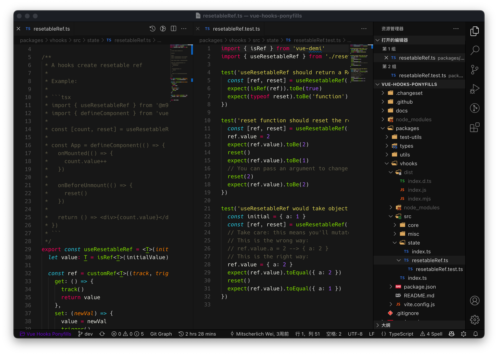

<samp><b>m9ch's VS Code Settings</b></samp>

 

<samp>Preview</samp>

<samp>&nbsp;&nbsp;&nbsp;&nbsp;&nbsp;&nbsp;&nbsp;&nbsp;&nbsp;&nbsp;&nbsp;&nbsp;&nbsp;&nbsp;Theme | <a href="https://github.com/fabiospampinato/vscode-monokai-night">Monokai Night Theme</a> 
Font | <a href="https://github.com/source-foundry/Hack">Hack</a> 
&nbsp;&nbsp;&nbsp;&nbsp;&nbsp;&nbsp;&nbsp;&nbsp;&nbsp;&nbsp;File Icons | <a href="https://github.com/be5invis/vscode-iconset">Nomo Dark Icon Theme</a> 

<samp><b>See:</b></samp>

[`.vscode/settings.json`](./.vscode/settings.json) 
[`.vscode/extensions.json`](./.vscode/extensions.json)
